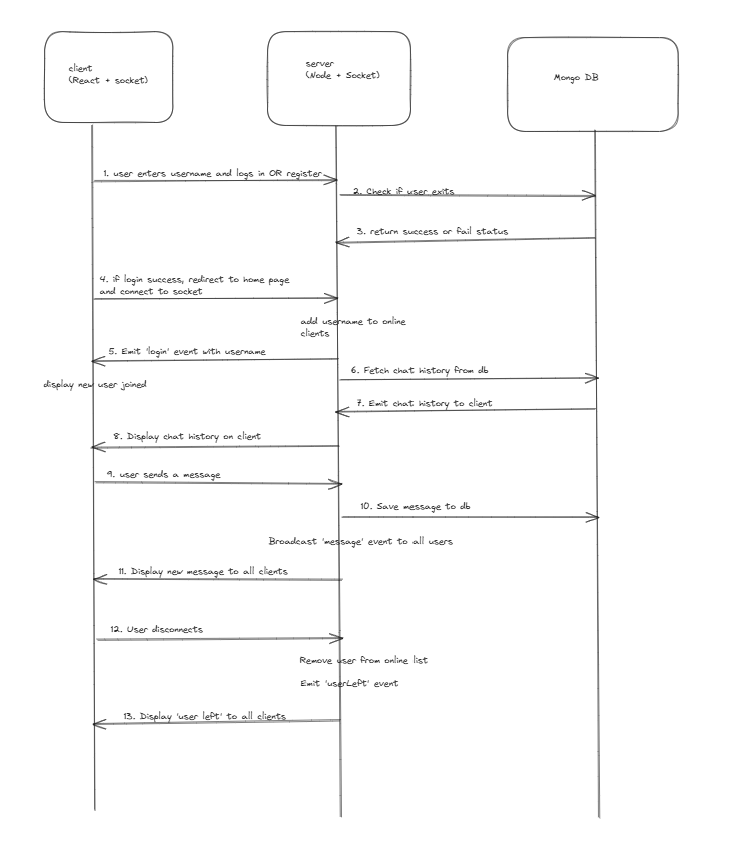

# LiaChat - Real-Time Chat Application

LiaChat is a modern, real-time chat application designed for instant communication. It includes features like real-time messaging, typing indicators, and innovative chat summarization powered by Google Gemini AI. Built with a robust tech stack, LiaChat offers a seamless and responsive user experience across all devices.

<a href="https://regal-figolla-01a138.netlify.app/">**Checkout Live Here**</a>

##  Features
  * **Login-Logout Feature**: Login or register using username.
  * **Real-Time Messaging**: Send and receive messages instantly with WebSocket technology.
  * **Typing Indicators**: See when other users are actively typing a message.
  * **User Status**: Others can see when you left or joined the chat.
  * **Chat Summarization**: Quickly get the gist of long conversations using intelligent summarization provided by Google Gemini AI.
  * **Responsive Design**: Enjoy a consistent and seamless experience on desktops, tablets, and mobile devices, thanks to TailwindCSS.

## Tech Stack

### Frontend

  * **React**: A declarative, component-based JavaScript library for building user interfaces.
  * **Vite**: A lightning-fast build tool that provides a rapid development experience for modern web projects.
  * **TailwindCSS**: A utility-first CSS framework for rapidly building custom designs directly in your HTML.
  * **Socket.IO**: A JavaScript library for real-time web applications, enabling bi-directional communication between web clients and servers.

### Backend

  * **Node.js**: A JavaScript runtime built on Chrome's V8 JavaScript engine, used for building scalable network applications.
  * **Express**: A fast, unopinionated, minimalist web framework for Node.js, used for building robust APIs.
  * **Socket.IO**: The same powerful library used on the frontend, enabling real-time communication between the server and clients.
  * **MongoDB / MongoAtlas**: A popular NoSQL document database used for storing chat history efficiently.
  * **Google Gemini AI**: Leveraged for its advanced capabilities in summarizing chat history.

## Application Flow



## 🛠️ Getting Started

Follow these steps to get LiaChat up and running on your local machine.

### Prerequisites

Before you begin, ensure you have the following installed:

  * **Node.js**: Make sure you have Node.js installed. You can download it from [nodejs.org](https://nodejs.org/).
  * **MongoDB**: Install and run MongoDB locally, or use a cloud service like [MongoDB Atlas](https://www.mongodb.com/atlas).
  * **Google Gemini API Key**: Obtain an API key from Google GenAI by visiting their [developer console](https://console.cloud.google.com/apis/credentials).

### Installation

1.  **Clone the Repository**:

    ```bash
    git clone https://github.com/yogesh2i/liaChat
    cd LiaChat
    ```

2.  **Install Dependencies**:

      * **Frontend**:
        ```bash
        cd frontend
        npm install
        ```
      * **Backend**:
        ```bash
        cd ../backend
        npm install
        ```

### Set Up Environment Variables

Create `.env` files in both the `frontend` and `backend` directories as follows:

  * **Frontend `.env`**:

    ```
    VITE_BASE_API = http://localhost:8000/api
    VITE_BASE_SOCKET = http://localhost:8000
    ```

  * **Backend `.env`**:

    ```
    PORT=8000
    MONGO_URI=your_mongodb_connection_string
    GOOGLE_GEMINI_API_KEY=your_google_gemini_api_key
    PROD_URL= http://localhost:8000
    ALLOWED_ORIGIN= http://localhost:5173
    ```


### Run the Application

1.  **Backend**:
    Navigate to the `backend` directory and start the server:

    ```bash
    cd backend
    npm run start
    ```

2.  **Frontend**:
    Open a new terminal, navigate to the `frontend` directory, and start the development server:

    ```bash
    cd frontend
    npm run dev
    ```

### OR Using docker 
   After creating env files for both backend and frontend run:
   
   ```
    docker compose up --build
   ```

### Access the Application

Once both the backend and frontend servers are running, open your web browser and navigate to:

```
http://localhost:5173
```

## Project Structure


```
LiaChat/
├── frontend/
│   ├── src/
│   │   ├── components/
│   │   │   ├── Auth/
│   │   │   ├── ChatBox/
│   │   │   ├── Home/
│   │   │   └── Navbar/
│   │   ├── context/
│   │   │   └── UserContext.jsx
│   │   ├── utilities/
│   │   │   ├── constants.js
│   │   │   └── socket.js
│   │   ├── App.css
│   │   ├── App.jsx
│   │   ├── index.css
│   │   └── main.jsx
└── backend/
    ├── src/
    │   ├── controllers/
    │   │   ├── authController.js
    │   │   └── chatController.js
    │   ├── handlers/
    │   │   ├── connectionHandler.js
    │   │   ├── joinHandler.js
    │   │   ├── messageHandler.js
    │   │   └── typingHandler.js
    │   ├── models/
    │   │   ├── Chat.js
    │   │   └── User.js
    │   ├── routes/
    │   │   ├── authRoutes.js
    │   │   └── chatRoutes.js
    │   ├── server/
    │   │   ├── app.js
    │   │   ├── db.js
    │   │   └── socket.js
    │   └── utilities/
    │       └── generateData.js
    ├── index.js
    ├── package-lock.json
    └── package.json
```

##  API Endpoints

### Chat Endpoints

  * **POST `/api/chat/history`**: Retrieve the complete chat history.

  * **POST `/api/chat/save`**: Save a new message to the chat history.
      * **Request Body Example**:
        ```json
        {
            "user": "username",
            "text": "Hello, world!",
            "type": "message",
            "timestamp" : "date"
        }
        ```
  * **POST `/api/chat/summarize`**: Summarize the current chat history using Google Gemini AI.

### User Endpoints

  * **POST `/api/auth/login`**: Authenticate and log in an existing user.
      * **Request Body Example**:
        ```json
        {
            "username": "johndoe",
        }
        ```
  * **POST `/api/auth/register`**: Register a new user account.
      * **Request Body Example**:
        ```json
        {
            "username": "newuser",
        }
        ```

**Note**: API documentation can also be found inside api routes.

